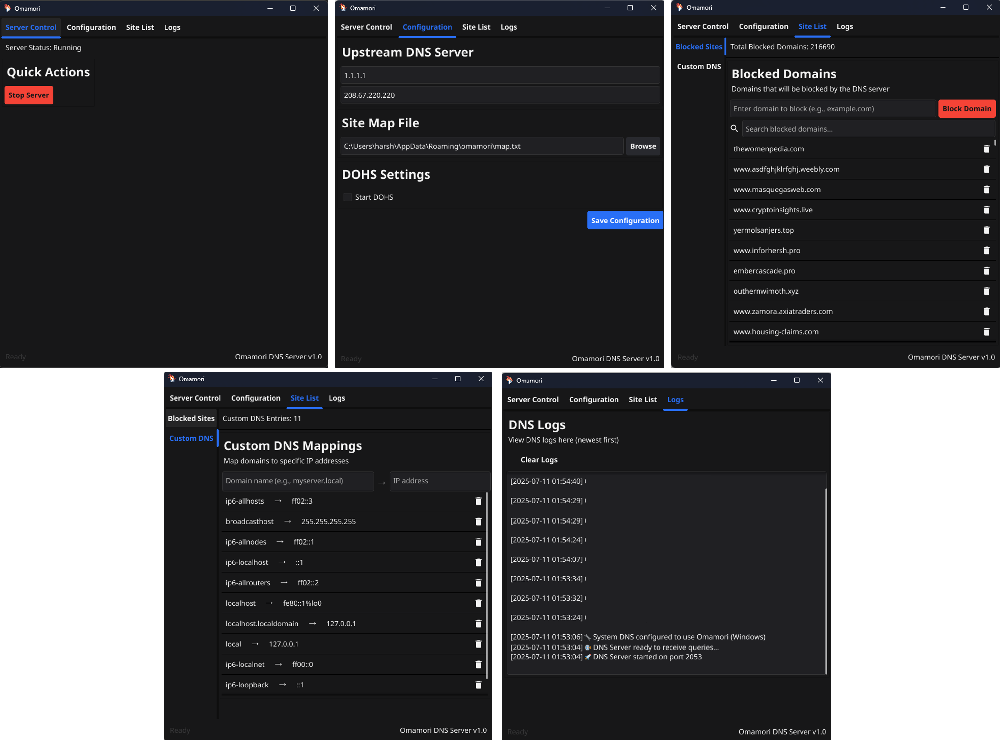

# Omamori - protection from unholy


## Features

- ✅ Domain Blocking
- ✅ DNS resolution with configurable upstream servers
- ✅ LRU cache (1000 entries, 5s cleanup interval)
- ✅ Supports all standard DNS record types
- ✅ DNS-over-HTTPS (DoH) support
- ✅ Custom DNS Mapping
- ✅ Supports Windows and Linux
- ✅ System DNS integration - Automatically sets system DNS to Omamori server


## Setup

```bash
apt install dnsutils -y
git clone https://github.com/OmamoriSec/omamori-stub.git
cd omamori-stub

chmod +x scripts/build/common.sh && ./scripts/build/common.sh
```

Based on your platform:
```bash
# Linux
chmod +x scripts/build/linux.sh && ./scripts/build/linux.sh

# Windows
chmod +x scripts/build/windows.sh && ./scripts/build/windows.sh
```

Run with approriate privileges:
```bash
# Linux
sudo ./omamori

# Windows (Run as Administrator)
.\omamori.exe
```

## Usage

### GUI Interface



## Configuration Files

Omamori stores configuration in user's config directory:

- **Linux**: ` /root/.config/omamori/`
- **Windows**: `C:\Users\<username>\AppData\Roaming\omamori\`

Key Files:
- `config.json`: Main configuration file
- `map.txt`: Custom DNS mappings
- `cert/`: Directory for DoH certificates
